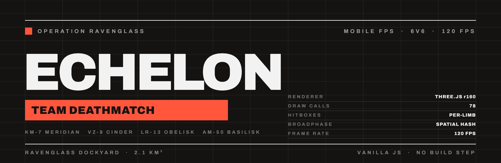
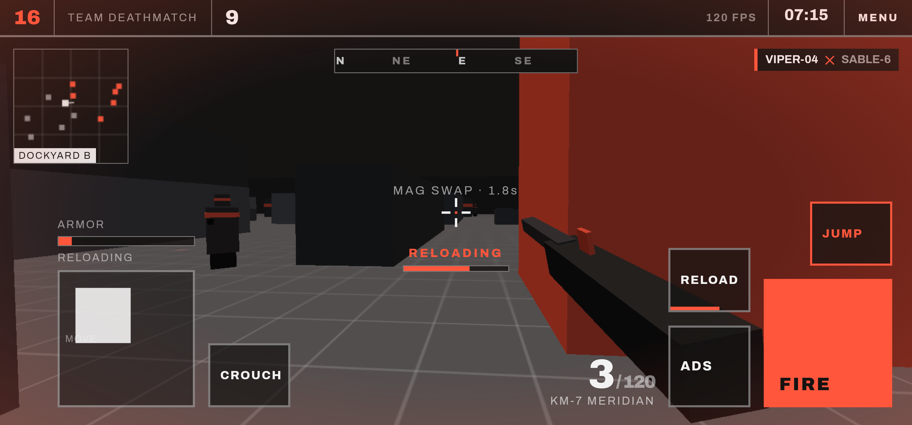
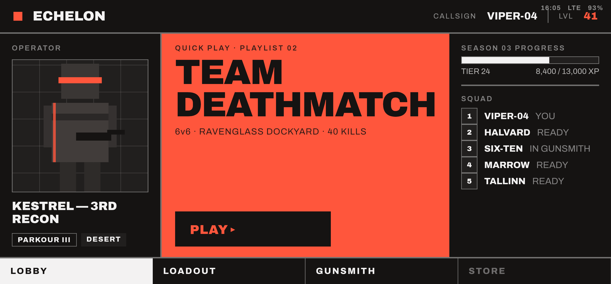
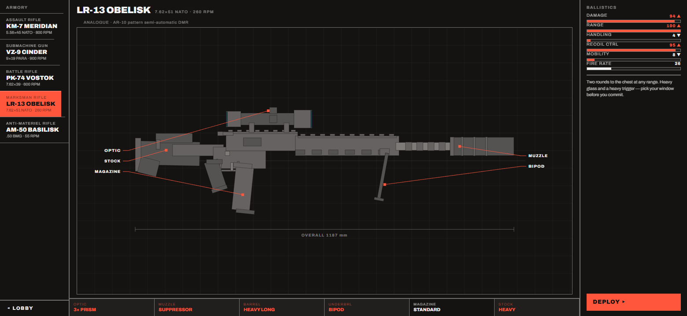
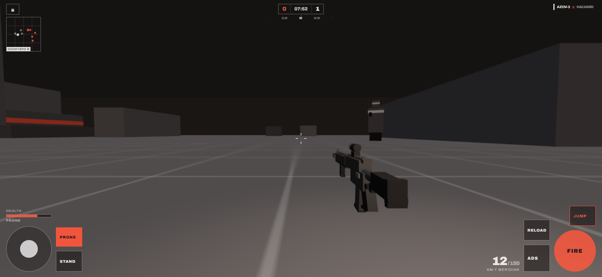
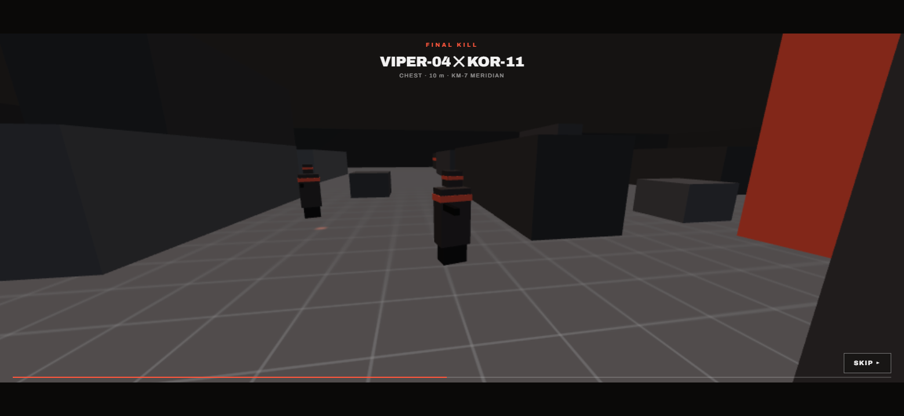
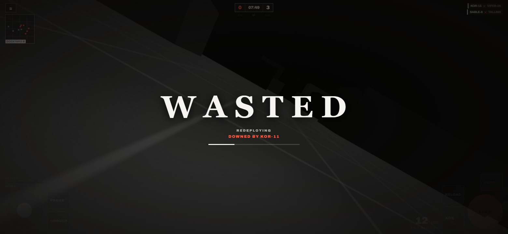
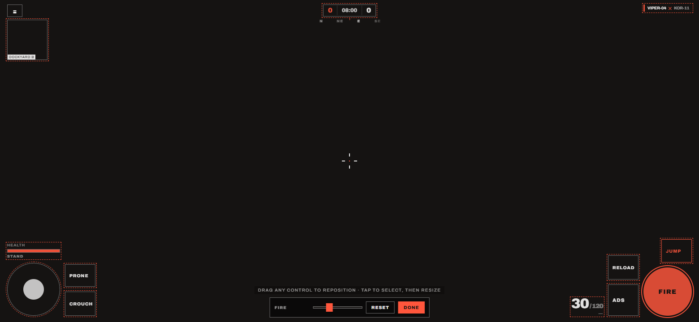

<div align="center">



<br>

<a href="https://warm-sun-523.higgsfield.gg/"></a>
&nbsp;
<a href="https://github.com/Cyberpunk0070/echelon-mobile-fps/releases/latest"></a>

<br><br>


<br>


</div>

<br>

<table>
<tr><td width="60%" valign="top">

### What this is

ECHELON began as a static design comp — a Swiss/Modernist UI concept for a mobile shooter. Flat colour and Archivo Black, one red accent, hairline grids, no rounded corners anywhere.

This repository is that comp turned into a game you can actually play. Behind the boot sequence, lobby and armory sits a real FPS: hitscan ballistics, per-limb hitboxes, learnable recoil patterns, three stances with slides and combat dives, a squad of AI that fights back and gets harder as the match runs, and a kill cam on the round-winning shot.

Every menu on the front end does something. There is no season pass, no store, no XP meter and no invented ping — if a number is on screen, it is read from the game.

</td><td width="40%" valign="top">

### Specification

| | |
|---|---|
| **Mode** | 6v6 team deathmatch |
| **Map** | Ravenglass Dockyard, 2.1 km² |
| **Weapons** | 6 · 6 attachment slots each |
| **Stances** | stand · crouch · prone |
| **Enemies** | 4 AI archetypes, 3 skill tiers |
| **Target** | configurable, 25–60 kills |
| **Frame rate** | 120 fps |
| **Assets** | none — geometry and audio are generated |

</td></tr>
</table>

---

<div align="center">

## Gameplay



<sub><b>CONTACT</b> · Tracer leaving the real muzzle, brass mid-eject, health bleeding out. The weapon is a modelled M4-pattern carbine, not a stand-in block.</sub>

<br><br>

<table>
<tr>
<td width="50%"></td>
<td width="50%"></td>
</tr>
<tr>
<td align="center"><sub><b>LOBBY</b> · Your actual primary, drawn as a schematic, next to match settings that feed the match. Nothing here is decoration.</sub></td>
<td align="center"><sub><b>ARMORY</b> · A true orthographic side view of the exact build you are carrying, with the overall length measured off the model.</sub></td>
</tr>
<tr>
<td width="50%"></td>
<td width="50%"></td>
</tr>
<tr>
<td align="center"><sub><b>PRONE</b> · Eye line at 0.34 m, spread cut by 58%, recoil by half — and a silhouette the AI is measurably worse at hitting.</sub></td>
<td align="center"><sub><b>FINAL KILL</b> · The round-winning shot replayed from the shooter's side of the line, with the limb, the range and the weapon.</sub></td>
</tr>
<tr>
<td width="50%"></td>
<td width="50%"></td>
</tr>
<tr>
<td align="center"><sub><b>DOWNED</b> · The world desaturates, the controls step back, and a sustained sting holds until you redeploy.</sub></td>
<td align="center"><sub><b>HUD EDITOR</b> · Drag any control anywhere, resize it independently, saved to the device.</sub></td>
</tr>
</table>

</div>

---

## The armory

Six weapons, each a rough depiction of a real service firearm. The geometry is described once and consumed twice — merged into the 3D viewmodel you carry, and projected onto the ZY plane for the menu schematic. **The diagram in the armory is a real orthographic side view of the gun in your hands**, down to the printed overall length, because it is drawn from the same part list.

| | Class | Cartridge | Analogue |
|:--|:--|:--|:--|
| **KM-7 MERIDIAN** | Assault rifle | 5.56×45 NATO · 800 RPM | M4A1-pattern carbine, direct impingement |
| **VZ-9 CINDER** | Submachine gun | 9×19 Para · 900 RPM | MP5-pattern roller-delayed SMG |
| **PK-74 VOSTOK** | Battle rifle | 7.62×39 · 600 RPM | AKM-pattern long-stroke piston rifle |
| **LR-13 OBELISK** | Marksman rifle | 7.62×51 NATO · 260 RPM | AR-10 pattern semi-automatic DMR |
| **AM-50 BASILISK** | Anti-materiel rifle | .50 BMG · 55 RPM | M82-pattern short-recoil rifle |
| **GX-60 HELLSPIN** | Rotary LMG | 7.62×51 · 1400 RPM | Electrically driven six-barrel gatling |

Attachments are not stat multipliers with a label. Fitting a suppressor puts a can on the barrel and changes the report; the CQB barrel shortens the handguard and pulls the gas block back; the extended magazine grows the AK's banana curve by two more segments. Optic choice moves the sight line, and **ADS aligns that sight line to the camera axis** — which is why the red dot sits exactly on the reticle when the aim finishes.

Nothing is loaded from disk. Every weapon is built at life size from boxes and cylinders, then merged into one geometry per material, so a full rifle with optic, brake, grip and bipod is **5–7 draw calls**.

---

## Movement

| Stance | Eye | Speed | Spread | Recoil | Enters in |
|:--|:--|:--|:--|:--|:--|
| **Stand** | 1.55 m | 100% | 100% | 100% | — |
| **Crouch** | 1.00 m | 50% | 70% | 76% | 0.22 s |
| **Prone** | 0.34 m | 18% | 42% | 48% | 0.55 s |

Stance changes lock the trigger for the duration of the transition, so dropping prone is a commitment rather than a free crouch-spam. Standing up is refused outright when there is no headroom.

Three moves come out of sprinting:

- **Slide** — sprint, then tap stance. Direction locks, speed decays from a 22% sprint overspeed into a crouch, the camera leans into it and the weapon swings wide.
- **Combat dive** — sprint, then tap prone. You leave the ground, keep your momentum, and land flat with a half-second recovery.
- **Mantle** — jump at a ledge between 0.5 m and 1.9 m and you pull yourself onto it, unless the landing has no standing room.

---

## Controls

Two thumb clusters with a guaranteed-empty centre channel, and **every one of them can be moved and resized**. Positions are stored as viewport fractions, so a layout survives a rotation or a different phone.

| Action | Touch | Desktop |
|:--|:--|:--|
| Move | left virtual stick | <kbd>W</kbd> <kbd>A</kbd> <kbd>S</kbd> <kbd>D</kbd> |
| Look | drag the right side | mouse — click to lock the pointer |
| Fire | hold **FIRE** | left mouse |
| Aim while firing | drag off **FIRE**, or use a second finger | mouse is always free |
| ADS / scope | tap **ADS** — toggle | hold right mouse |
| **Sprint** | **push the stick to the outer ring** | <kbd>Shift</kbd> |
| Crouch | tap **CROUCH** | <kbd>C</kbd> |
| Prone | **PRONE**, or hold **CROUCH** | <kbd>Z</kbd> / <kbd>Ctrl</kbd> |
| Slide / dive | sprint, then **CROUCH** / **PRONE** | <kbd>Shift</kbd> + <kbd>C</kbd> / <kbd>Z</kbd> |
| Reload | **RELOAD** | <kbd>R</kbd> |
| Jump / mantle | **JUMP** | <kbd>Space</kbd> |
| Pause | **≡** | <kbd>Esc</kbd> / back gesture |

<table><tr><td>

**Why the input is built this way.** Touch controls started out single-touch: while any finger was down, taps on other buttons did nothing. The cause was `click` — it is single-pointer, and the browser stops synthesising it for an entire gesture once `preventDefault()` runs on another active touch.

Input is built on **Pointer Events, one independent stream per finger**. Every control reacts to `pointerdown` and owns its own `pointerId`, with pointer capture guaranteeing the matching release even if the thumb slides off — so a control can neither be blocked nor left latched. Move, look, fire, ADS and reload are all usable simultaneously.

**Sprint has no button.** Shove the movement stick to the outer ring while heading forward and the ring lights red (0.95 in / 0.8 out hysteresis). Combat outranks sprint — firing, aiming, reloading or leaving the standing stance suppress it — so a stick parked at the ring never cancels your aim or blocks the trigger.

</td></tr></table>

---

## Gunplay

**Recoil is a pattern, not a dice roll.** Each weapon walks a fixed table of per-shot offsets, so the same gun climbs the same way every time and pulling down through a magazine is a skill. The carbine rises then drifts right; the AK is savage for six rounds then walks hard right; the SMG zig-zags shallowly. Past the end of the table the pattern oscillates.

Recoil is applied as a **camera offset that recovers to zero** once the trigger rests, so fighting the climb never leaves your aim permanently displaced. Stance and ADS both scale it, and the crosshair opens with the live spread — including sustained fire — so the reticle is a bloom readout rather than decoration.

Everything else in the shot is real: the tracer starts at the modelled muzzle, brass ejects from the modelled port with its own ballistics, a pooled spark burst marks the impact point, and a single reused point light flashes the surroundings. Rounds are damaged by limb (`HEAD` ×2.0 · `CHEST` ×1.0 · `ABDOMEN` ×0.9 · `LEGS` ×0.75) and fall off with distance.

**Touch aim assist** is a two-part model: look sensitivity drops while the reticle is on a target, and a gentle rotational pull acts inside a 4.5° (hip) / 7° (aimed) cone. Both scale with a single slider and switch off completely at zero. Neither applies to mouse input, and neither fires unless the player is already moving, looking or shooting.

---

## Kill cam and the downed screen

A ring buffer records every combatant's transform at 20 Hz for the last ten seconds — flat `Float32Array` frames, zero allocation while the match runs. When the round-winning kill lands, the match end is held back and the shot is replayed from a camera set a few metres off the victim along the line the round came from, with the moment of the kill slowed to a third speed.

When your health runs out, the world desaturates and rolls into a death cam while a **WASTED** card fades in with a respawn meter and the name of whoever put you down. Every control dims out of the way, because nothing is actionable while you are down.

> [!NOTE]
> The downed sting is an **original piece synthesised in Web Audio** — a low D-minor cluster under a slow low-pass sweep, sustained until you redeploy. It is a nod to the genre convention, not a copy of anyone's soundtrack; no licensed audio ships with this build. It can be switched off in Settings.

---

## Settings

Everything is stored in `localStorage` and applied live — the pause menu opens the same screen, so you can retune mid-match.

| Group | |
|:--|:--|
| **Display** | HUD scale, HUD opacity, field of view, camera shake |
| **Controls** | look and ADS sensitivity, aim assist, invert Y, southpaw mirror, auto-sprint |
| **Reticle** | crosshair length, gap, centre dot |
| **HUD elements** | independent toggles for score, minimap, compass, kill feed, ammo, vitals, status line, stance button, FPS |
| **Audio** | master volume, downed sting, final kill cam |

**EDIT HUD LAYOUT** drops you into the live HUD with every control outlined. Drag to reposition, tap to select and resize independently, RESET to go back to the tuned defaults.

---

## The AI

Enemies are not one averaged behaviour. Each bot is drawn from four archetypes with genuinely different threat profiles:

| Archetype | Speed | Band | Cadence | Behaviour |
|:--|:--|:--|:--|:--|
| **RUSHER** | 5.2 m/s | 3–14 m | 820 RPM | Closes hard and brawls, shortest reaction |
| **MARKSMAN** | 3.5 m/s | 26–55 m | 260 RPM | Holds long angles, highest accuracy |
| **FLANKER** | 4.8 m/s | 6–22 m | 700 RPM | Wide routes, heavy strafing |
| **ANCHOR** | 4.0 m/s | 12–34 m | 600 RPM | Holds ground and suppresses |

Each has its own turn rate, burst pattern, accuracy and **reaction delay** — a bot that has just spotted you cannot fire instantly. They run line-of-sight checks against your real chest height, so going prone genuinely changes what they can see and how often they hit. They hold their preferred range band, retarget when shot, and fight each other as well as you.

Difficulty **escalates** with match progress, tracking whichever is further along: the clock or the leading score. Periodically a fireteam commits a **coordinated push** onto your position. The RECRUIT / REGULAR / VETERAN selector in the lobby scales accuracy, damage and reaction time on top of all of it.

---

## Under the hood

The frame loop is uncapped and vsync-paced; the native Android shell requests the panel's highest refresh mode. Measured **120 fps on a Galaxy S23 Ultra** and 144 fps on a 144 Hz desktop panel.

| | |
|:--|:--|
| **Instanced world** | Every static box draws from one shared unit-box geometry through one `InstancedMesh` per colour. The whole dockyard is **6 draw calls instead of ~110**. |
| **Merged weapons** | Each weapon's primitives are transformed and concatenated into one buffer per material at build time. A fully-kitted rifle is 5–7 calls; the magazine and charging handle stay separate so they can animate. |
| **Pooled effects** | Tracers and impact sparks each live in a single `LineSegments` over a fixed buffer; brass is one `InstancedMesh`. Sustained crossfire allocates nothing, so there are no GC hitches. |
| **Adaptive resolution** | Scales relative to the *measured* vsync period rather than a fixed frame budget, so it behaves correctly at both 60 and 120 Hz. The refresh estimate uses the second-smallest frame delta per window, so one early `rAF` callback cannot skew it. |
| **Spatial-hash broadphase** | A uniform grid indexes the world AABBs. Collision and ground queries test only overlapping cells; rays walk the grid with a **2D DDA** that stops as soon as the nearest hit precedes the next cell boundary. |
| **Segmented hitboxes** | Four boxes slab-tested in each bot's local frame. A headshot is a real head intersection, not a height comparison. |
| **Never stuck** | The player is depenetrated from any geometry they end up inside, recovers from falls out of the world, and every pointer id is reconciled so a dropped release from an Android system gesture cannot latch the stick or the trigger. |

Three.js is vendored locally and the font is self-hosted. There are no textures, no meshes and no audio files: the ground is a generated canvas, the weapons are generated geometry, and every sound is synthesised in Web Audio. **No network fetches at runtime.**

---

## Run it locally

`http.server` serves whatever directory you are standing in, so run it from the project root:

```bash
cd echelon-mobile-fps && python -m http.server 8123
```

Then open <http://localhost:8123>. ES modules need a server — opening `index.html` over `file://` will fail on CORS. Any static server works; there is nothing Python-specific about it. No `npm install` required for the web build.

Append `#armory`, `#settings` or `#play` to jump straight past the boot sequence — handy when you are iterating on one screen.

## Build the APK

Requires **JDK 21** — Capacitor 7 rejects 17 — and the Android SDK. Point Gradle at your JDK via `org.gradle.java.home` in `~/.gradle/gradle.properties`, and set `sdk.dir` in the untracked `android/local.properties`.

```bash
npm install
```

```bash
pwsh ./build-www.ps1 && npx cap sync android && cd android && ./gradlew.bat assembleDebug
```

The APK lands at `android/app/build/outputs/apk/debug/app-debug.apk` — package `gg.echelon.ravenglass`, minSdk 24, targetSdk 36. Install with `adb install -r <path>`.

The native shell forces the display's highest refresh mode, immersive sticky fullscreen, landscape orientation and keep-screen-on, and ships every asset offline.

> [!NOTE]
> The published build is **debug-signed**, so Android will warn about unknown sources and Play Protect may flag it. That is expected for sideloading — a release build needs your own signing keystore.

## Layout

```
index.html          every screen + the Modernist CSS
js/app.js           screen state machine, boot, lobby, armory, settings, HUD editor
js/settings.js      persisted preferences, HUD scale/opacity/visibility, layout map
js/data.js          weapons, attachments, recoil patterns, ballistics translation
js/weapons3d.js     weapon geometry — merged 3D viewmodels and the menu schematic
js/game.js          world, player controller, stances, combat, kill cam, HUD, audio
js/bots.js          AI archetypes and combat behaviour
android/            Capacitor shell — MainActivity sets the 120 Hz display mode
docs/shots/         the screenshots above
```

---

<div align="center">
<sub>Built with <a href="https://claude.com/claude-code">Claude Code</a></sub>
</div>
