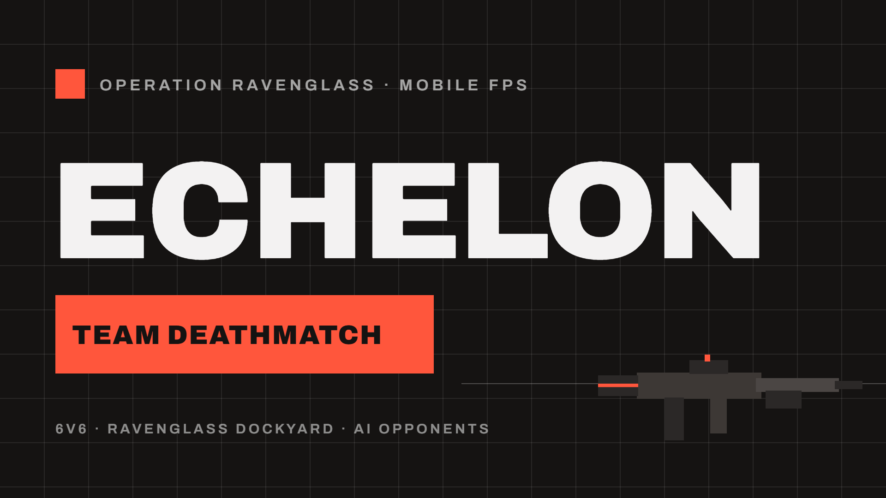
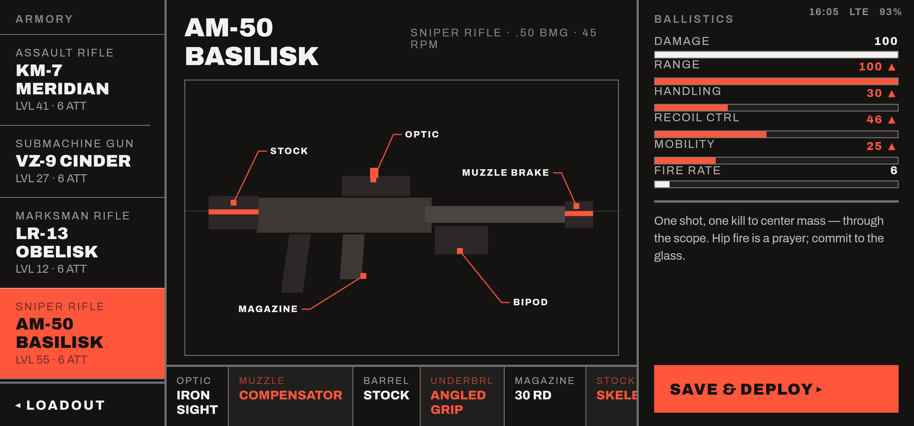
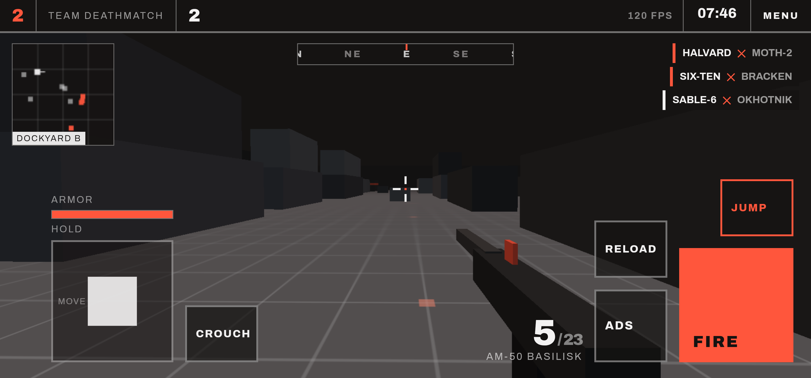
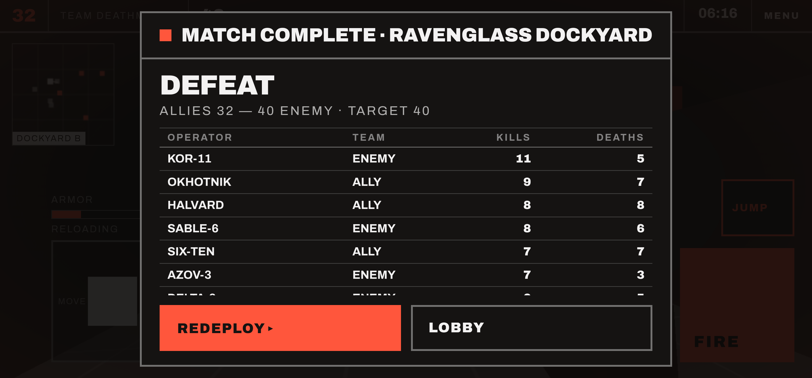

<div align="center">



# ECHELON — Operation Ravenglass

**A mobile first-person shooter with AI opponents.**
6v6 team deathmatch, real multi-touch controls, four enemy archetypes, a bolt-action sniper — running at 120 fps in a browser.

### ▶ [**Play it now — warm-sun-523.higgsfield.gg**](https://warm-sun-523.higgsfield.gg/)

*Open on a phone in landscape, or on desktop with WASD + mouse.*
*Android build: [`ECHELON-debug.apk`](#building-the-apk) — sideload for immersive fullscreen at the panel's native 120 Hz.*

`vanilla JS` · `Three.js r160` · `no build step` · `~250 KB` · `offline-capable`

</div>

---

## What this is

ECHELON started as a static design comp — a Swiss/Modernist UI concept for a mobile shooter, five screens of flat colour and Archivo Black with a single red accent. This repository is that comp turned into a game you can actually play: the boot sequence, lobby, loadout, gunsmith and HUD are all functional, and behind them sits a real FPS — hitscan ballistics, segmented hitboxes, a spatial-hash broadphase, and a squad of AI that fights back.

The visual language never changed. Everything is still flat blocks, hairline grids, squared corners and one red.

---

## Gameplay

<table>
<tr>
<td width="50%"></td>
<td width="50%"></td>
</tr>
<tr>
<td><b>Contact.</b> Mid-reload with an enemy closing, kill feed live, armour nearly gone — the damage vignette bleeding in at the edges. 120 fps, on-device.</td>
<td><b>Lobby.</b> The design comp's own layout, working: operator card, playlist hero, season progress and squad roster.</td>
</tr>
<tr>
<td></td>
<td></td>
</tr>
<tr>
<td><b>Gunsmith.</b> Four weapons, six attachment slots, labelled callouts wired to the parts they name. Attachment deltas drive real ballistics — the stat bars are not decoration.</td>
<td><b>AM-50 BASILISK.</b> .50 BMG bolt-action: 45 RPM, five rounds, one shot one kill to centre mass. Hip fire is a prayer.</td>
</tr>
<tr>
<td colspan="2"></td>
</tr>
<tr>
<td colspan="2"><b>Match end.</b> Per-operator K/D across both teams, scrollable, with REDEPLOY and LOBBY pinned on screen.</td>
</tr>
</table>

---

## Controls

Two thumb clusters with a guaranteed-empty centre channel. Every control is positioned from shared layout tokens (`--edge-*`, `--col2-*`) that also absorb the punch-hole and gesture-bar safe areas, so no two controls can ever collide.

| Action | Touch | Desktop |
|---|---|---|
| Move | left virtual stick | `W` `A` `S` `D` |
| Look | drag the right side | mouse (click to lock the pointer) |
| Fire | hold **FIRE** | left mouse |
| Aim while firing | drag off **FIRE**, or use a second finger | mouse is always free |
| ADS / scope | tap **ADS** (toggle) | hold right mouse |
| **Sprint** | **push the stick to the outer ring** | `Shift` |
| Crouch | **CROUCH** | `C` |
| Reload | **RELOAD** | `R` |
| Jump / mantle | **JUMP** | `Space` |
| Pause | **MENU** | `Esc` / back gesture |

### Why the input is built the way it is

Touch controls started out single-touch: while any finger was down, taps on other buttons did nothing. The cause was `click` — it is single-pointer, and the browser stops synthesising it for an entire gesture once `preventDefault()` runs on another active touch.

Input is now built on **Pointer Events, one independent stream per finger**. Every control reacts to `pointerdown` and owns its own `pointerId`, with pointer capture guaranteeing the matching release even if the thumb slides off — so a control can neither be blocked nor left latched. Nothing depends on `click`. Move, look, fire, ADS and reload are all usable simultaneously.

Sprint has no button. Shove the movement stick to the outer ring while heading forward and the ring lights red (0.95 in / 0.8 out hysteresis). Combat outranks sprint — firing, aiming, reloading or crouching suppress it — so a stick parked at the ring never cancels your aim or blocks the trigger.

---

## The AI

Enemies are not one averaged behaviour. Each bot is drawn from four archetypes with genuinely different threat profiles:

| Archetype | Speed | Engagement band | Behaviour |
|---|---|---|---|
| **RUSHER** | 5.2 m/s | 3–14 m | Closes hard and brawls, high fire rate, short reaction |
| **MARKSMAN** | 3.5 m/s | 26–55 m | Holds long angles, high accuracy, slow deliberate cadence |
| **FLANKER** | 4.8 m/s | 6–22 m | Wide routes, heavy strafing |
| **ANCHOR** | 4.0 m/s | 12–34 m | Holds ground and suppresses |

Each has its own turn rate, burst pattern, accuracy and **reaction delay** — a bot that has just spotted you cannot fire instantly. They run line-of-sight checks, hold their preferred range band, retarget when shot, and fight each other as well as you.

Difficulty **escalates** with match progress, tracking whichever is further along: the clock or the leading score. Late rounds are faster, sharper and more aggressive. Periodically a fireteam commits a **coordinated push** onto your position.

---

## Under the hood

**Runs at 120 fps.** The frame loop is uncapped and vsync-paced; the native Android shell requests the panel's highest refresh mode. Measured 120 fps on a Galaxy S23 Ultra and 144 fps on a 144 Hz desktop panel, at 78 draw calls.

- **Instanced world** — every static box draws from one shared unit-box geometry through one `InstancedMesh` per colour. The whole dockyard is 6 draw calls instead of ~110.
- **Pooled tracers** — all tracers live in a single `LineSegments` over a fixed buffer. Sustained crossfire allocates nothing, so there are no GC hitches. Total scene geometry count stays at 3.
- **Adaptive resolution** relative to the *measured* vsync period rather than a fixed frame budget, so it behaves correctly at both 60 and 120 Hz. The refresh estimate uses the second-smallest frame delta per window, so one early `rAF` callback cannot skew it.
- **Spatial-hash broadphase** — a uniform grid indexes the world AABBs. Collision and ground queries test only overlapping cells, and rays walk the grid with a **2D DDA** that stops as soon as the nearest hit precedes the next cell boundary.
- **Segmented hitboxes** — `HEAD` ×2.0, `CHEST` ×1.0, `ABDOMEN` ×0.9, `LEGS` ×0.75, slab-tested in each bot's local frame. A headshot is a real head intersection, not a height comparison.
- **Never stuck** — the player is depenetrated from any geometry they end up inside (previously both movement axes failed forever), recovers from falls out of the world, and every pointer id is reconciled so a dropped release from an Android system gesture cannot latch the stick or the trigger.
- Three.js is vendored locally and the font is self-hosted: no network fetches at runtime.

---

## Run it locally

```bash
python -m http.server 8123
```

Then open <http://localhost:8123>. ES modules need a server — `file://` will not work.

## Building the APK

Requires **JDK 21** (Capacitor 7 rejects 17) and the Android SDK. Point Gradle at your JDK via `org.gradle.java.home` in `android/gradle.properties`, and set `sdk.dir` in the untracked `android/local.properties`.

```bash
npm install
```

```bash
pwsh ./build-www.ps1 && npx cap sync android && cd android && ./gradlew.bat assembleDebug
```

The APK lands at `android/app/build/outputs/apk/debug/app-debug.apk` — package `gg.echelon.ravenglass`, minSdk 24, targetSdk 36. Install with `adb install -r <path>`.

The native shell forces the display's highest refresh mode, immersive sticky fullscreen, landscape orientation and keep-screen-on, and ships every asset offline.

> The debug build is debug-signed, so Android will warn about unknown sources and Play Protect may flag it. That is expected for sideloading — a release build needs your own signing keystore.

## Layout

```
index.html          all five screens + the Modernist CSS
js/app.js           screen state machine, boot sequences, lobby/loadout/gunsmith
js/data.js          weapon, attachment, telemetry and phase tables
js/game.js          Three.js world, player controller, combat, ADS, HUD, audio
js/bots.js          AI archetypes and combat behaviour
android/            Capacitor shell (MainActivity sets the 120 Hz display mode)
docs/shots/         the screenshots above, captured on-device
```

---

<div align="center">

Built with [Claude Code](https://claude.com/claude-code).

</div>
